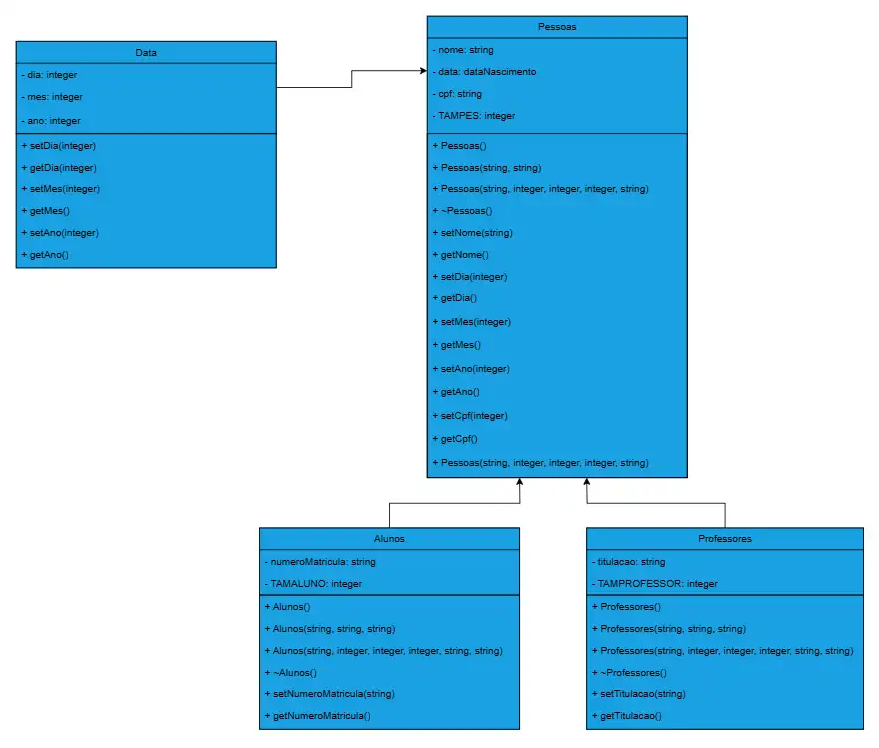

Olá Lúcio!
Fiz meu trabalho prático e tentei implementar algumas coisinhas simples a mais para estudar.   
Teve apenas uma coisa que não consegui fazer e entender sozinho, que é ler o arquivo de alunos e professores ao inicializar o progrma, tinha conseguido fazer mas não funcionou 100%.  
De resto, pelo o que testei, está tudo certo.  
Foi bem complicado fazer esse trabalho mas, com ele, adiquiri vários conhecimentos bons, obrigado pelo semestre e pelos ensinamentos!  
Abraços!  

FOTO DO DIAGRAMA UML:   
Caso não apareça a foto abaixo ela está na dentro da pasta também, além desse arquivo aberto com a imagem(2 imagens).   
    

Aluno: Gabriel Teotônio de Castro Coelho Costa    
Para rodar no VS Code: -o teste.exe    